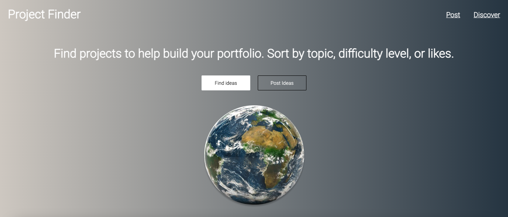
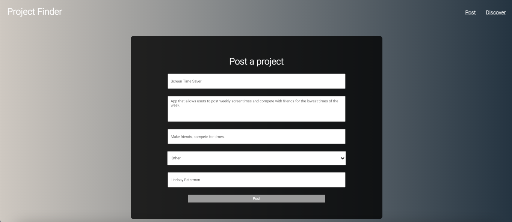
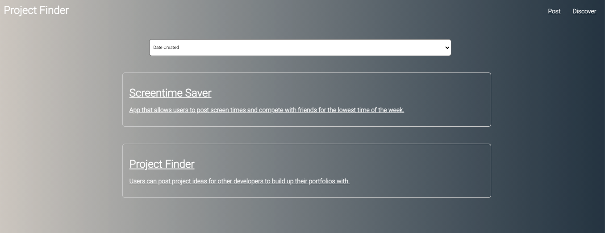

# Moonshot

**Live site: https://project-finder.vercel.app/**

Browse through project ideas to build up your portfolio. 

If you have some cool ideas that could help people out, post them!

Moonshot helps developers find project ideas to build up their portfolios. People can post ideas and devs can sort through them until they find one they like. You can sort by topic, difficulty level, or likes. 

I made this app because I like spending my time solving actual problems. It can be hard to come up with a good idea for a project yourself so Moonshot allows for more communication and classification of ideas to work with.

**Check out the site:** 

**Post some ideas:**

**Discover:**

**Stack:**

React, CSS, Node, Express, PostgreSQL

